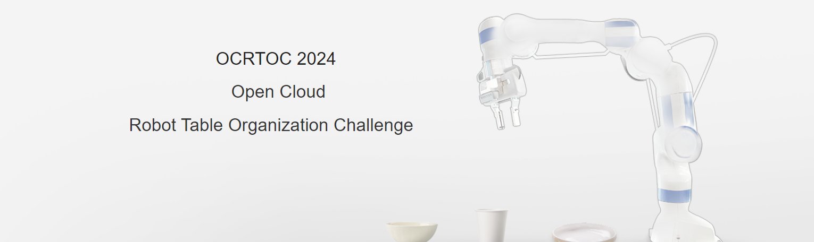

# Open Cloud Robot Table Organization Challenge 2024 (OCRTOC) 



## Overview
This is the OCRTOC software package. The homepage for OCRTOC is: [www.ocrtoc.org](http://www.ocrtoc.org). A brief video introduction, showcasing highlights from the previous OCRTOC challenge, is available on [Youtube](https://www.youtube.com/watch?v=9dlWUbPF2Cc&t=1s) and [BiliBili](https://www.bilibili.com/video/BV1MV411W7aa/).

To take part in OCRTOC 2024, you need to develop your own solution using this software package. After uploading your solution to the competition platform, the performance of your solution will be evaluated. 
 

## Set up Environment
In order for your solution to be executable both on your local machine and our competition platform, we provide you with a docker image with some pre-installed software. You need to develop and test your solution within this docker image. To set up the environment, you can use the pre-built docker image. The following instructions provide more details.

### System Requirement
- The software package must run on a computer with a NVIDIA GPU.
- Proper NVIDIA driver must be installed ([https://phoenixnap.com/kb/install-nvidia-drivers-ubuntu](https://phoenixnap.com/kb/install-nvidia-drivers-ubuntu))
- Docker must be installed ([https://docs.docker.com/engine/install/ubuntu/](https://docs.docker.com/engine/install/ubuntu/))
- NVIDIA container runtime must be installed ([https://www.celantur.com/blog/run-cuda-in-docker-on-linux/](https://www.celantur.com/blog/run-cuda-in-docker-on-linux/))

### Clone the Repository into your home folder 

There are some submodules in the software package, and you need to clone the repository recursively.

```bash
git clone https://github.com/OCRTOC/OCRTOC_software_package --recursive
```

or

```bash
git clone https://github.com/OCRTOC/OCRTOC_software_package
cd OCRTOC_software_package
git submodule update --init --recursive
```

### Pull docker image
```bash
docker pull ocrtoc/ocrtoc2024_mujoco:latest
```
### Content of the Docker Image
- Operating System: Ubuntu 20.04
- CUDA 12.3
- MuJoCo 2.3.3
- gymnasium 0.29.1

### Start docker container
We provide two scripts for creating and executing the docker image. Please modify the **name** and **path** in the scripts according to your own needs.
```bash
# Create docker container with the provided image
bash tools/create_container.sh ocrtoc/ocrtoc2024_mujoco:latest

# Enter the docker container
bash tools/exec_container.sh
```
Please note that the docker container will not restart automatically if your host operating system restarts. We also provide another script for you to restart the docker container.
```bash
# Restart docker container
bash tools/start_container.sh

# Enter the docker container
bash tools/exec_container.sh
```

### Setup simulation assets
You need to run the following commands to download required assets to run the simulation. It is not necessary to run these commands again when you restart the docker container.

```bash
# Enter the docker container
bash tools/exec_container.sh

## In the docker image
cd /root/ocrtoc_ws
bash tools/setup_env_mujoco.sh
```

### Sample solution using keyboard control
Now you have finished setting up the environment, and you can try to run the simulation and control the robot using keyboard. We provide a sample solution using keyboard to control the robot. In the following we show how to run the keyboard controller on your local machine.
```bash
# Enter the docker container
bash tools/exec_container.sh

## In the docker image
cd /root/ocrtoc_ws/ocrtoc_gym
python3 run.py
```
```
Keyboard control mapping 
w -> +x 
s -> -x
a -> +y
d -> -y 
q -> +z 
e -> -z
y -> +yaw
x -> -yaw
o -> open gripper
c -> close gripper 
m -> task done
```


## Build Your Own Solution


### Object 6D Poses in Simulation
For debugging purposes, you can read the object 6D poses from the simulation.
However, you should **NEVER READ THE OBJECT 6D POSES DIRECTLY FROM SIMULATION IN YOUR SOLUTION**. Violation of the rule will result in invalid scores. 

### Challenge framework 
The OCRTOC for the MuJoCo simulation is built upon Gymnasium. The general framework of challenge consists of two components: an Agent (`ocrtoc_agent`) and a set of environment (`ocrtoc_env`). You should re-implement the agent named `MyAgent` located in `ocrtoc_agent/agent_builder.py`. You can change parameters in `agent_config.yml` to change task ID or object categories. 


## Evaluation
The `run.py` is the entry point of evaluation. Each time you run `ocrtoc_gym/run.py` script, your agent will be automatically evaluated. The score will be written into `ocrtoc_gym/ocrtoc_env/result` folder. Besides, you can check evaluation result of a specific task in the `ocrtoc_gym/ocrtoc_env/evaluation` folder. 

In our evaluation server, we will overwrite the `ocrtoc_gym/ocrtov_env` folder and modify the task parameters in the `agent_config.yml` file. So please make sure To implement your solution in the `ocrtoc_gym/ocrtoc_agent` folder.

## Submission

### Prepare the Docker Image
After you have finished developing your solution, you need to upload the entire docker image for submission. 

Normally, the `/root/ocrtoc_ws` directory is mounted in the docker image using `-v` flag which makes it easier for software development. However, if you commit your docker image directly, the files will not be saved in the docker image. The solution to this problem is that you should first umount the directory and copy it into the docker image as shown below.

1. Copy the Files into the Docker Image
```bash
# In the software package directory in the host operating system
docker cp OCRTOC_software_package ocrtoc:/root # ocrtoc is the container name. Make changes according to your needs.
cd OCRTOC_software_package
bash tools/exec_container.sh

# In the docker image
cd /root
umount ocrtoc_ws
rm -rf ocrtoc_ws
mv OCRTOC_software_package ocrtoc_ws
cd ocrtoc_ws
```

2. Commit Your Docker Image

```bash
# Export a docker image using the docker container.
docker commit ocrtoc your_submission_docker_image_name # ocrtoc is the container name. Make changes according to your needs.
```


### Final Submission
The participants will be informed by email how to submit your own docker image.

## Information from previous challenges
### Video tutorials  
To give you a more intuitive impression on how to use the whole OCRTOC software package, the following video tutorials are provided:
- Software package:  [Youtube](https://www.youtube.com/watch?v=WRdUDNuTZ_0), [BiliBili](https://www.bilibili.com/video/BV1EB4y1T7jK/).
- Program execution and baseline solution:  [Youtube](https://www.youtube.com/watch?v=FT6-bDch258), [BiliBili](https://www.bilibili.com/video/BV1Cq4y1s7Fp/).
- Submission:  [Youtube](https://www.youtube.com/watch?v=ghslvJfp_Ys), [BiliBili](https://www.bilibili.com/video/BV1AX4y1w7UN/).
- Dataset:  [Youtube](https://www.youtube.com/watch?v=PGvtBTyZqhU), [BiliBili](https://www.bilibili.com/video/BV14L411p7kK/).

### Frequently Asked Question (FAQ) 

Frequently asked questions are available in [`FAQ.md`](FAQ.md).

### Labelled Dataset from previous challenges
To ease your development process we provide a labelled real world dataset. To use this dataset you need to download the toolkit from [https://github.com/OCRTOC/OCRTOC_dataset_toolkit](https://github.com/OCRTOC/OCRTOC_dataset_toolkit).

In this dataset, a lot of scenes with multiple objects are scanned using a wrist-mounted real sense D435i camera. Each scene is captured from 79 different perspective. For each scene, the per-scene object poses are labelled. The per-scene object poses are used to generate the per-frame object poses and 2D object masks for each rgbd image. Object models are available at [`ocrtoc_materials/models`](/ocrtoc_materials/models). We will continueously extend this dataset. Till July 1st, 2021, the statistics of this dataset is as follows:
- Annotations: per-scene object pose, per-frame object pose, 2D object mask on each RGB image
- Number of scenes: 76
- Number of used objects: 33
- Number of labelled RGB-D images: 6004


## Citation
If you find our work helpful, please cite the following paper: [https://arxiv.org/pdf/2104.11446.pdf](https://arxiv.org/pdf/2104.11446.pdf)
```bibtex
@misc{liu2021ocrtoc,
title={OCRTOC: A Cloud-Based Competition and Benchmark for Robotic Grasping and Manipulation},
author={Ziyuan Liu and Wei Liu and Yuzhe Qin and Fanbo Xiang and Minghao Gou and Songyan Xin and Maximo A. Roa and Berk Calli and Hao Su and Yu Sun and Ping Tan},
year={2021},
eprint={2104.11446},
archivePrefix={arXiv},
primaryClass={cs.RO}
}
```