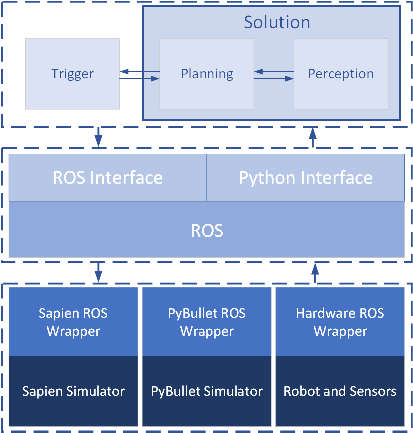

# Open Cloud Robot Table Organization Challenge 2024 (OCRTOC) 

## Overview
This is the OCRTOC software package. The homepage for OCRTOC is: [www.ocrtoc.org](http://www.ocrtoc.org). A brief video introduction about OCRTOC is available on [Youtube](https://www.youtube.com/watch?v=9dlWUbPF2Cc&t=1s) and [BiliBili](https://www.bilibili.com/video/BV1MV411W7aa/).

To take part in OCRTOC, you need to develop your own solution using this software package. After uploading your solution to the competition platform, the performance of your solution will be evaluated. 

For the simulation stage, we support two simulators: PyBullet and Sapien. You can choose either of them to test your solution on your local machine. On the competition platform you can choose either of them for performance evaluation.

For the real robot stage, your solution will be tested on real robot hardware. The software interfaces for sensor readings and robot control are the same for both simulation and the real robot hardware. So you will not encounter interface issues when transferring your solution from simulation to the real robot.

The structure of the system is shown in the figure below.




## Set up Environment
In order for your solution to be executable both on your local machine and our competition platform, we provide you a docker image with some pre-installed software. You need to develop and test your solution within this docker image. To set up the environment, you can use the pre-built docker image. Alternatively, you can also set up the environment by running the commands in the [Dockerfile](docker/Dockerfile) one by one. The following instructions provide more details.

### System Requirement
- The software package must run on a computer with a NVIDIA GPU.
- Proper NVIDIA driver must be installed ([https://phoenixnap.com/kb/install-nvidia-drivers-ubuntu](https://phoenixnap.com/kb/install-nvidia-drivers-ubuntu))
- Docker must be installed ([https://docs.docker.com/engine/install/ubuntu/](https://docs.docker.com/engine/install/ubuntu/))
- NVIDIA container runtime must be installed ([https://www.celantur.com/blog/run-cuda-in-docker-on-linux/](https://www.celantur.com/blog/run-cuda-in-docker-on-linux/))
- Ubuntu 22.04 are tested and recommended, other Linux distribution may also work.

### Clone the Repository

There are some submodules in the software package, and you need to clone the repository recursively.

```bash
git clone https://github.com/OCRTOC/OCRTOC_software_package --recursive
```

or

```bash
git clone https://github.com/OCRTOC/OCRTOC_software_package
cd OCRTOC_software_package
git submodule update --init --recursive
```

### Set up Docker
- Option 1 (links need to be updated): Pull the pre-built docker image from either of the following sources:
```bash
docker pull registry.cn-hangzhou.aliyuncs.com/ocrtoc2021/release:2.1
```

or

```bash
docker pull registry.us-west-1.aliyuncs.com/ocrtoc2021/release:2.1
```
- Option 2: Build docker image from docker file.
```bash
cd docker
bash build.sh your_registry:tag
```

### Start Docker
We provide two scripts for creating and executing the docker image. Please modify the **name** and **path** in the scripts according to your own needs.
```bash
# Create docker container
bash tools/create_container.sh [Your docker image]

# Enter the docker container
bash tools/exec_container.sh
```

When your host operating system restarts, the docker will not restart automatically.
We also provide another script for you to restart the docker.
```bash
# Restart docker container
bash tools/start_container.sh

# Enter the docker container
bash tools/exec_container.sh
```

### Set up Environment inside the Docker Container
Since some parts of the environment are given as source code, they cannot be installed while building the docker image. You need to run the following commands to set up the environment. However, you don't need to run them when you restart the docker container. 

```bash
# Enter the docker container
bash tools/exec_container.sh

## In the docker image
cd /root/ocrtoc_ws/tools
bash setup_env.sh
```

### Content of the Docker Image
- Operating System: Ubuntu 20.04
- ROS noetic-desktop-full
- moveit 1.1.13
- CUDA 12.3
- PyBullet 3.2.5
- ceres-solver 2.0
- colmap 3.7
- pycolmap 0.5.0
- Sapien (pre-build version)
- torch==1.8.2, torchvision==0.7.0, open3d==0.12.0 for python3
- assimp v5.0.1
- glm 0.9.9.8
- glfw 3.3.3
- spdlog v1.8.5

Now you have finished setting up the environment, and you can try to run the baseline solution.

## Baseline Solution
<span id="baseline_solution"></span>
To ease your development process, we provide a baseline solution, based on which you can build your own solution. In the following we show an example on how to run our baseline solution in the PyBullet simulator on your local machine.

First, open 3 terminals and execute the following commands in each of the terminal.

```bash
# In the first terminal
bash tools/exec_container.sh
cd root/ocrtoc_ws/
source devel/setup.bash
# In the docker image
# Start the PyBullet simulator and ros interface
roslaunch ocrtoc_task bringup_simulator_pybullet.launch task_index:=0-0

# Start the Sapien simulator and ros interface
# roslaunch ocrtoc_task bringup_simulator_sapien.launch task_index:=0-0
```

```bash
# In the second terminal
bash tools/exec_container.sh
cd root/ocrtoc_ws/
source devel/setup.bash

# In the docker image
# Start the solution server
roslaunch ocrtoc_task solution.launch
```

```bash
# In the third terminal
bash tools/exec_container.sh
cd root/ocrtoc_ws/
source devel/setup.bash

# In the docker image
# Start the trigger and start the task
roslaunch ocrtoc_task trigger.launch task_index:=0-0
```

## Build Your Own Solution

For performance evaluation on the OCRTOC platform we run the above three launch files as well. For the real robot branch, we bring up the real robot hardware instead of simulation. As long as your solution works fine with the simulation, it will also be executable on the real hardware.

### Baseline Solution 
To start with, we provide a baseline solution that mainly contains two parts `ocrtoc_perception` and `ocrtoc_planning`. To develop your own solution, you can easily modify the content of the baseline solution. Alternatively, you can also develop your own solution from scratch. No matter how you build your solution, you need to guarantee that your solution can be called by the `solution.launch` script in `ocrtoc_task`, because this is how your solution will be launched during evaluation.

### Interfaces

#### ROS Topics
You can read from or write to ROS topics to interact with the robot (for both real robot and simulation). To develop your own solution, you can use the following topics. These topics share the same names in both simulation and real robot hardware. With this consistency, a solution that is developed in simulation can be evaluated on the real robot hardware as well.
- /tf
    - world
    - panda_link0-panda_link8
    - panda_ee_link
    - realsense_color_optical_frame
    - rgb_camera_link
- /franka_gripper/gripper_action/goal (**This is the distance from one finger-tip to the center of both fingers (in meter)**)
- /position_joint_trajectory_controller/follow_joint_trajectory/goal
- /kinect/
    - /kinect/depth_to_color/image_raw
    - /kinect/color/camera_info
    - /kinect/color/image_rect_color
    - /kinect/depth/points
- /realsense/
    - /realsense/aligned_depth_to_color/image_raw
    - /realsense/color/camera_info
    - /realsense/color/image_raw
    - /realsense/depth/points
- /joint_states

Apart from the above topics, there exist also other topics, however, their consistency in simulation and real robot is not guaranteed. 


#### Python Interfaces
For those who are not familiar with ROS, we also provide python interfaces for the following functions.
- Read camera images
- Get transformation (TF) information
- Robot control 
- Gripper control

For more details, you can refer to [ocrtoc_common](ocrtoc_common/README.md).

You can try out some interfaces using the following scripts.

```bash
# In the first terminal
bash tools/exec_container.sh

# In the docker image
roslaunch ocrtoc_task bringup_simulator_pybullet.launch task_index:=0-0
```

```bash
# In the second terminal
bash tools/exec_container.sh

# In the docker image
roslaunch panda_moveit_config ocrtoc.launchAp
```

```bash
# In the third terminal
bash tools/exec_container.sh

# In the docker image
roscd ocrtoc_common/test
python test_camera_interface.py # also executable with pyhon3
python test_manipulator_interface.py # also executable with pyhon3
python test_transform_interface.py # also executable with pyhon3
python test_gripper_interface.py # also executable with pyhon3
```

### Object 6D Poses in Simulation
For debugging purposes, you can read the object 6D poses in simulation via `/get_model_state` interface. An example is given in [`ocrtoc_task/scripts/get_6dpose_dump_simulator.py`](ocrtoc_task/scripts/get_6dpose_dump_simulator.py).

However, you should **NEVER READ THE OBJECT 6D POSES DIRECTLY FROM SIMULATION IN YOUR SOLUTION**. Violation of the rule will result in invalid scores. 

## Evaluation

The evaluation module is provided so that you can evaluate your own solution in simulation.

The steps are similar to running [baseline solution](#baseline_solution). The only difference is that you should launch `trigger_and_evaluation.launch` instead of `trigger.launch`.

```bash
# Run the same program in the first two terminals.
# In the third terminal
bash tools/exec_container.sh

# In the docker image
# Start the trigger and start the task
roslaunch ocrtoc_task trigger_and_evaluation.launch task_index:=0-0
```

The task score will be printed in the terminal and also saved to `ocrtoc_task/evaluation/0-0_score.txt`.

## Submission

### Prepare the Docker Image
After you have finished developing your solution, you need to upload the entire docker image for submission. 

Normally, the `/root/ocrtoc_ws/src` directory is mounted in the docker image using `-v` flag which makes it easier for software development. However, if you commit you docker image directly, the files will not be saved in the docker image. The solution to this problem is that you should first umount the directory and copy it into the docker image as shown below.

1. Copy the Files into the Docker Image
```bash
# In the software package directory in the host operating system
docker cp OCRTOC_software_package ocrtoc:/root/ocrtoc_ws # ocrtoc is the container name. Make changes according to your needs.
cd OCRTOC_software_package
bash tools/exec_container.sh

# In the docker image
cd /root/ocrtoc_ws
umount src
rm -rf src
mv OCRTOC_software_package src
catkin_make
```

2. Commit Your Docker Image

```bash
# Export a docker image using the docker container.
docker commit ocrtoc your_submission_docker_image_name # ocrtoc is the container name. Make changes according to your needs.
```

3. Submit Your Docker Image

You can upload your docker image to any platform that can be accessed by us, e.g. Docker Hub.

### Final Submission 
For the final submission, you need to fill out a yaml file and email it to [info@ocrtoc.org](mailto://info@ocrtoc.org). In the following, an example of this yaml file is provided. Please pay attention that if your docker image is private, you need to provide the username and password so that we can pull the docker image.

```yaml
info:
    team_name: "***"
    contact_email: "***@***"
    member: ["***", "***", "***"]
    affiliation: ["***", "***", "***"]
evalution:
    # Participate in the 'Simulation' or 'Real Robot' branch? [sim | real | both]
    branch: "sim"
    # The simulator you want to use in the 'Simulation branch' [Pybullet-ROS | Sapien-ROS]
    simulator: "Pybullet-ROS"    # Not available for 'Real Robot branch'
    # Which part of the baseline solution was modified to create this solution? The evalution result will be shown in different tracks.
    # modified_perception == True, modified_planning == True, Main track only
    # modified_perception == True, modified_planning == False, Main track and Perception track
    # modified_perception == False, modified_planning == True, Main track and Planning track
    # modified_perception == False, modified_planning == False, no evaluation 
    modified_perception: True    # [True | False] 
    modified_planning: False     # [True | False]
docker:
    image: "***/***/***:***"
    permission: public    # [public | private]
    # If the permission of your image is 'private', you need to provide the user_name&pwd.
    user_name: NA    # [*** | NA]
    pwd: NA          # [*** | NA]
```


## Labelled Dataset (Real World)
To ease your development process we provide a labelled real world dataset. To use this dataset you need to download the toolkit from [https://github.com/OCRTOC/OCRTOC_dataset_toolkit](https://github.com/OCRTOC/OCRTOC_dataset_toolkit).

In this dataset, a lot of scenes with multiple objects are scanned using a wrist-mounted real sense D435i camera. Each scene is captured from 79 different perspective. For each scene, the per-scene object poses are labelled. The per-scene object poses are used to generate the per-frame object poses and 2D object masks for each rgbd image. Object models are available at [`ocrtoc_materials/models`](/ocrtoc_materials/models). We will continueously extend this dataset. Till July 1st, 2021, the statistics of this dataset is as follows:
- Annotations: per-scene object pose, per-frame object pose, 2D object mask on each RGB image
- Number of scenes: 76
- Number of used objects: 33
- Number of labelled RGB-D images: 6004

## Video Tutorial
To give you a more intuitive impression on how to use the whole OCRTOC software package, the following video tutorials are provided:
- Software package:  [Youtube](https://www.youtube.com/watch?v=WRdUDNuTZ_0), [BiliBili](https://www.bilibili.com/video/BV1EB4y1T7jK/).
- Program execution and baseline solution:  [Youtube](https://www.youtube.com/watch?v=FT6-bDch258), [BiliBili](https://www.bilibili.com/video/BV1Cq4y1s7Fp/).
- Submission:  [Youtube](https://www.youtube.com/watch?v=ghslvJfp_Ys), [BiliBili](https://www.bilibili.com/video/BV1AX4y1w7UN/).
- Dataset:  [Youtube](https://www.youtube.com/watch?v=PGvtBTyZqhU), [BiliBili](https://www.bilibili.com/video/BV14L411p7kK/).


## Frequently Asked Question (FAQ)

Frequently asked questions are available in [`FAQ.md`](FAQ.md).

## Citation
If you find our work helpful, please cite the following paper: [https://arxiv.org/pdf/2104.11446.pdf](https://arxiv.org/pdf/2104.11446.pdf)
```bibtex
@misc{liu2021ocrtoc,
title={OCRTOC: A Cloud-Based Competition and Benchmark for Robotic Grasping and Manipulation},
author={Ziyuan Liu and Wei Liu and Yuzhe Qin and Fanbo Xiang and Minghao Gou and Songyan Xin and Maximo A. Roa and Berk Calli and Hao Su and Yu Sun and Ping Tan},
year={2021},
eprint={2104.11446},
archivePrefix={arXiv},
primaryClass={cs.RO}
}
```

## Technical Support
If you encounter technical issues regarding this software package, please contact us at [info@ocrtoc.org](mailto://info@ocrtoc.org) or raise a github issue.


## OCRTOC Fan Group
You can also join our fan group on [Slack](https://ocrtoc.slack.com/join/shared_invite/zt-se6z93pf-Wra_ZMG2Oi63i9LzUpjiEw#/shared-invite/email) to give us feedbacks and stay tuned.


